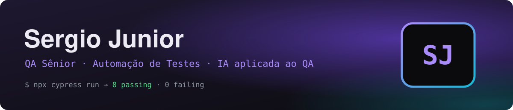

<p align="center">
  
</p>

<p align="center">
  
</p>

<p align="center">
  <a href="https://sergiojunior.dev"></a>
  <a href="https://www.linkedin.com/in/adssergio/"></a>
  <a href="mailto:jrfariaaa@hotmail.com"></a>
  
</p>

---

```bash
$ npx cypress run --spec perfil.cy.js

  Sergio Junior · QA Sênior

    ✓ 300+ cenários E2E automatizados com Cypress          (812ms)
    ✓ regressão completa: 3–5 dias → 4 horas               (604ms)
    ✓ dashboard de sprint: daily 30 → 10 min               (510ms)
    ✓ jornadas críticas de telecom em Homolog e Produção   (640ms)
    ✓ APIs REST validadas no Postman · cenários em BDD     (295ms)
    ✓ mentorias, guildas e entrevistas técnicas            (388ms)
    ✓ IA aplicada ao QA + pós em IA                        (702ms)

  7 passing (3s)
  próximo spec: o seu time ▍
```

### ⚡ Agora

<table>
<tr>
<td align="center" width="33%">🔭<br><b>Trabalhando em</b><br><sub>Automação E2E no ecossistema Claro</sub></td>
<td align="center" width="33%">🌱<br><b>Aprendendo</b><br><sub>Playwright · TypeScript · Appium · Docker</sub></td>
<td align="center" width="33%">💬<br><b>Me pergunte sobre</b><br><sub>Cypress · BDD · IA aplicada a QA</sub></td>
</tr>
</table>

### 🎓 Formação

| Período | Curso | Instituição |
|---|---|---|
| 2026 – 2027 | **Pós em IA Aplicada à Transformação Digital** · *em andamento* | Anhanguera |
| 2025 – 2026 | **Pós em Engenharia de Software · Qualidade e Teste** | Anhanguera |
| 2021 – 2024 | **Análise e Desenvolvimento de Sistemas** | UniCesumar |

<p align="center"><sub>Achou algum bug neste perfil? Chame o QA… ah, sou eu mesmo. 🐞</sub></p>
